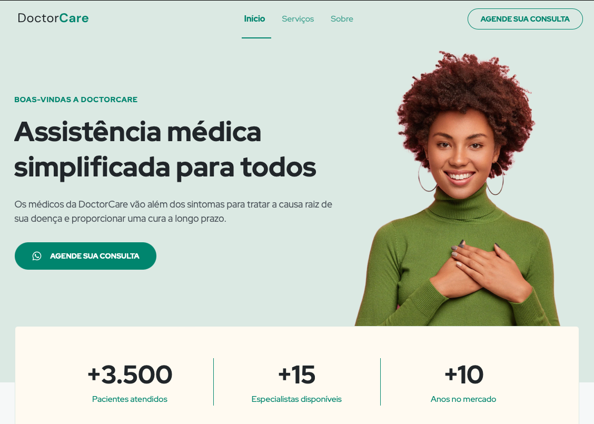

# Projeto Doctor View - Landing Page

## Intro :wave:

- Este projeto foi desenvolvido durante a **Next Level Week**, evento promovido pela [Rocketseat](https://www.rocketseat.com.br), onde pude aprender muito sobre **HTML, CSS e JavaScript**. 
- O objetivo da **NLW** é impulsionar a carreira `</Dev>` com muito Networking e Prática.
- Eu me inscrevi na Trilha Explorer, ministrada pelo grande [Mayk Brito](https://www.linkedin.com/in/maykbrito/?originalSubdomain=br), um cara S E N S A C I O N A L, que tem uma facilidade enorme em compartilhar conhecimento, e o melhor, o cara faz mágica :magic_wand:, sério, aprendi muito com esse brother.

## O Projeto

- O DoctorView é uma LandingPage responsiva, ou seja, funciona perfeitamente para Desktop quanto para Mobile.
- Aplica os melhores conceitos de CSS, utilizando recursos como `pseudo-class`, `media queries`, e até uma Biblioteca JavaScript para aninação chamada [ScrollReveal](http://scrollrevealjs.org/). O principal conceito sem dúvidas foi o **Mobile First**.
- Melhor do que explicar o projeto é ver na prática:
  - Link do Projeto desenvolvido por mim: [DoctorView](https://allanchazzy.github.io/NLW/)
  
